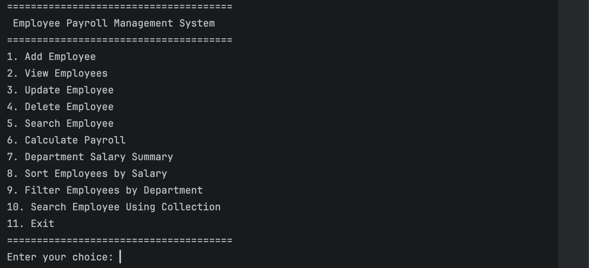
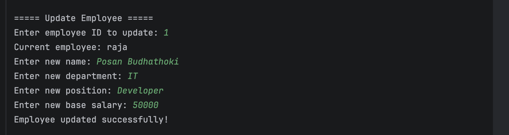
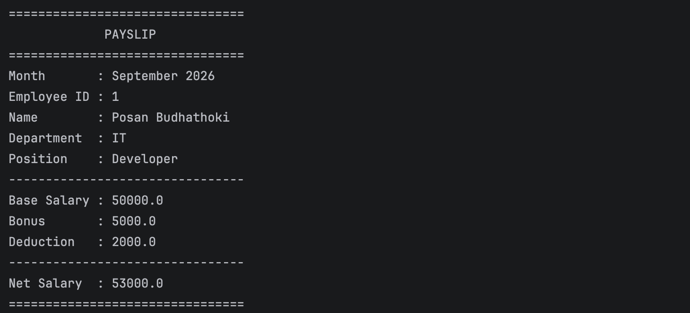

# Employee Payroll Management System

A simple Java-based Employee Payroll Management System.

## Features

- Add employee records
- View employee records
- Calculate net salary
- Include bonus# Employee Payroll Management System

A simple Java console-based Employee Payroll Management System for managing employee records and monthly payroll.

The system allows users to add, view, update, delete, and search employee records. It also calculates monthly salary using base salary, bonus, and deduction and generates a payslip-style report.

---

## 1. Features

### Employee Management

- Add employee records
- View all employee records
- Update employee information
- Delete employee records
- Search employee by ID

### Employee Information

Each employee record contains:

- Employee ID
- Employee Name
- Department
- Position
- Base Salary

### Payroll Management

- Calculate monthly payroll
- Add bonus
- Add deduction
- Calculate net salary
- Generate a payslip-style report for an employee and month

### Department Management

- View employees by department
- Display department salary summary

### Collection Features

- Use `ArrayList` to store employee records
- Use `HashMap` to search employees by ID
- Sort employees by salary
- Filter employees by department
- Iterate through employee records

### Validation and Exception Handling

- Validate numeric input
- Prevent negative salary, bonus, and deduction values
- Prevent empty text input
- Handle invalid menu choices
- Handle employee-not-found situations using a custom exception

### Database

- Store employee records in MySQL
- Use JDBC for database operations
- Use `PreparedStatement` for database queries
- Use a separate database configuration file

---

## 2. Technologies Used

- **Java** – Main programming language
- **JDK 17** – Java Development Kit
- **Maven** – Project and dependency management
- **MySQL** – Database
- **JDBC** – Java Database Connectivity
- **MySQL Connector/J** – MySQL JDBC driver
- **IntelliJ IDEA** – Development environment
- **Git** – Version control
- **GitHub** – Source code repository

---

## 3. Project Structure

```text
EmployeePayroll
│
├── pom.xml
├── README.md
├── schema.sql
├── .gitignore
│
└── src
    └── main
        ├── java
        │   └── com.example
        │       ├── Main.java
        │       ├── Person.java
        │       ├── Employee.java
        │       ├── Payable.java
        │       ├── EmployeeDAO.java
        │       ├── PayrollCalculator.java
        │       ├── EmployeeService.java
        │       ├── EmployeeNotFoundException.java
        │       │
        │       └── util
        │           └── DatabaseConnection.java
        │
        └── resources
            ├── db.properties
            └── db.properties.example
            
```
---

## 4. Database Setup

This project uses **MySQL** to store employee information.

### Database Name

```text
employee_payroll
```

### Table Name

```text
employees
```

### Employees Table

| Column | Data Type | Description |
|---|---|---|
| id | INT | Employee ID |
| name | VARCHAR(100) | Employee name |
| department | VARCHAR(100) | Employee department |
| position | VARCHAR(100) | Employee position |
| base_salary | DOUBLE | Employee base salary |

### SQL Schema

The complete database setup is provided in:

```text
schema.sql
```

The script creates the `employee_payroll` database and the `employees` table.

### Database Configuration

Create this local file:

```text
src/main/resources/db.properties
```

Add your own MySQL connection details:

```properties
db.url=jdbc:mysql://localhost:3306/employee_payroll
db.username=root
db.password=YourPassword
```

Replace `YourPassword` with your own MySQL password.

The `db.properties` file is ignored by Git so that database credentials are not uploaded to GitHub.

A safe example configuration is provided in:

```text
src/main/resources/db.properties.example
```

---
## 5. How to Run

### Requirements

Before running the project, make sure the following are installed:

- JDK 17
- IntelliJ IDEA
- Maven
- MySQL

### Step 1: Open the Project

Open the `EmployeePayroll` project in IntelliJ IDEA.

### Step 2: Create the Database

Open MySQL and run the SQL script from:

```text
schema.sql
```

This creates the `employee_payroll` database and the `employees` table.

### Step 3: Configure Database Connection

Create the following file:

```text
src/main/resources/db.properties
```

Add your own MySQL username and password:

```properties
db.url=jdbc:mysql://localhost:3306/employee_payroll
db.username=root
db.password=YOUR_PASSWORD
```

Replace `YOUR_PASSWORD` with your own MySQL password.

### Step 4: Load Maven Dependencies

Maven will download the required dependencies from `pom.xml`.

### Step 5: Run the Application

Open:

```text
src/main/java/com/example/Main.java
```

Run the `main()` method.

The application will start in the terminal.

### Main Menu

```text
======================================
 Employee Payroll Management System
======================================
1. Add Employee
2. View Employees
3. Update Employee
4. Delete Employee
5. Search Employee
6. Calculate Payroll
7. Department Salary Summary
8. Sort Employees by Salary
9. Filter Employees by Department
10. Search Employee Using Collection
11. Exit
======================================
```

---
## 6. Payroll Calculation

The system calculates net salary using the following formula:

```text
Net Salary = Base Salary + Bonus - Deduction
```

### Example

```text
Base Salary = 40000
Bonus       = 5000
Deduction   = 2000

Net Salary  = 43000
```

The payslip-style report displays:

- Month
- Employee ID
- Employee Name
- Department
- Position
- Base Salary
- Bonus
- Deduction
- Net Salary

---
## 7. Screenshots

The following screenshots show the application running in the terminal.

### Screenshot 1: Main Menu and Employee Records



### Screenshot 2: Employee Management



### Screenshot 3: Payroll Payslip



---
## 8. Known Limitations

The current project has the following limitations:

- The application is console-based and does not have a graphical user interface.
- Payroll calculation uses a simple bonus and deduction formula.
- Attendance and leave management are not included.
- Employee login and authentication are not included.
- Payslips are displayed in the terminal and are not exported to PDF or CSV.
- A MySQL database connection is required to run the application.

---
## 9. GitHub Repository

The complete project source code is available on GitHub:

https://github.com/ridamxetri28-eng/Employee-Payroll-Management-System